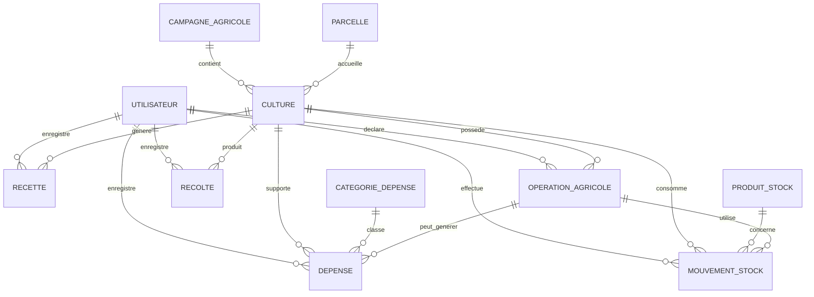

# Modele de donnees - Application de gestion comptable agricole

## 1. Objectif du modele

Le modele de donnees permet de stocker les informations necessaires a la gestion comptable et agricole d'une exploitation. Il couvre les cultures, les parcelles, les campagnes agricoles, les depenses, les recettes, les stocks et les operations agricoles.

L'objectif principal est de pouvoir repondre aux questions suivantes :

- Combien une culture a-t-elle coute ?
- Quelles depenses sont liees a une culture ?
- Quelles recettes ont ete obtenues apres la recolte ?
- Quel est le benefice ou la perte d'une culture ?
- Quels produits sont disponibles en stock ?
- Quelles operations agricoles ont ete realisees ?

## 2. Entites principales

### 2.1 Utilisateur

L'entite `utilisateur` represente les personnes qui utilisent l'application.

Champs principaux :

- `id` : identifiant unique.
- `nom` : nom de l'utilisateur.
- `prenom` : prenom de l'utilisateur.
- `email` : adresse email unique.
- `mot_de_passe` : mot de passe hache avec PBKDF2.
- `role` : role de l'utilisateur dans l'application.
- `actif` : indique si le compte est actif.
- `date_creation` : date de creation du compte.

Roles possibles :

- `ADMIN`
- `AGRICULTEUR`
- `COMPTABLE`

### 2.2 Campagne agricole

L'entite `campagne_agricole` represente une saison ou periode de production agricole.

Champs principaux :

- `id`
- `nom`
- `date_debut`
- `date_fin`
- `statut`

Statuts possibles :

- `PLANIFIEE`
- `EN_COURS`
- `TERMINEE`

### 2.3 Parcelle

L'entite `parcelle` represente une portion de terrain exploitee par l'agriculteur.

Champs principaux :

- `id`
- `nom`
- `superficie_ha`
- `localisation`
- `type_sol`
- `type_irrigation`
- `description`

Regle importante :

- La superficie doit etre strictement positive.

### 2.4 Culture

L'entite `culture` represente une culture agricole realisee sur une parcelle pendant une campagne.

Champs principaux :

- `id`
- `nom`
- `variete`
- `surface_ha`
- `date_semis`
- `date_recolte_prevue`
- `date_recolte_reelle`
- `statut`
- `campagne_id`
- `parcelle_id`

Statuts possibles :

- `PLANIFIEE`
- `EN_COURS`
- `RECOLTEE`
- `ANNULEE`

Relations :

- Une culture appartient a une campagne agricole.
- Une culture est associee a une parcelle.
- Une culture peut avoir plusieurs depenses.
- Une culture peut avoir plusieurs recettes.
- Une culture peut avoir plusieurs operations agricoles.
- Une culture peut avoir plusieurs recoltes.

### 2.5 Recolte

L'entite `recolte` represente une collecte de production issue d'une culture. Une meme culture peut avoir plusieurs recoltes.

Champs principaux :

- `id`
- `date_recolte`
- `quantite`
- `unite`
- `prix_unitaire`
- `montant_total`
- `observation`
- `culture_id`
- `utilisateur_id`
- `date_creation`

Regles importantes :

- La date et la quantite sont obligatoires.
- La quantite doit etre strictement positive.
- Une recolte doit obligatoirement etre associee a une culture.
- Le montant total peut etre calcule a partir de la quantite et du prix unitaire.

### 2.6 Categorie de depense

L'entite `categorie_depense` permet de classer les depenses.

Exemples :

- Semences
- Engrais
- Produits phytosanitaires
- Main-d'oeuvre
- Carburant
- Irrigation
- Location materiel
- Autres charges

Champs principaux :

- `id`
- `nom`
- `description`

### 2.7 Depense

L'entite `depense` represente une sortie d'argent liee a une culture ou a une operation agricole.

Champs principaux :

- `id`
- `libelle`
- `montant`
- `date_depense`
- `mode_paiement`
- `reference_piece`
- `culture_id`
- `categorie_id`
- `operation_agricole_id`
- `utilisateur_id`

Regles importantes :

- Le montant doit etre strictement positif.
- Une depense doit obligatoirement etre associee a une culture.
- Une depense peut etre associee a une operation agricole.

### 2.8 Recette

L'entite `recette` represente une entree d'argent, souvent liee a la vente d'une production.

Champs principaux :

- `id`
- `libelle`
- `montant`
- `date_recette`
- `quantite`
- `unite`
- `prix_unitaire`
- `culture_id`
- `utilisateur_id`

Regles importantes :

- Le montant doit etre strictement positif.
- Une recette doit etre associee a une culture.
- La quantite et le prix unitaire sont optionnels, mais utiles pour les ventes.

### 2.9 Produit stock

L'entite `produit_stock` represente un intrant ou produit disponible en stock.

Exemples :

- Semences
- Engrais
- Produits phytosanitaires
- Carburant
- Aliment
- Petit materiel consommable

Champs principaux :

- `id`
- `nom`
- `type_produit`
- `unite`
- `quantite_disponible`
- `seuil_alerte`
- `prix_unitaire_moyen`

Regles importantes :

- La quantite disponible ne peut pas etre negative.
- Le seuil d'alerte permet d'identifier les stocks faibles.

### 2.10 Mouvement de stock

L'entite `mouvement_stock` represente une entree, une sortie ou un ajustement de stock.

Champs principaux :

- `id`
- `type_mouvement`
- `quantite`
- `prix_unitaire`
- `date_mouvement`
- `motif`
- `produit_stock_id`
- `culture_id`
- `operation_agricole_id`
- `utilisateur_id`

Types possibles :

- `ENTREE`
- `SORTIE`
- `AJUSTEMENT`

Regles importantes :

- La quantite doit etre strictement positive.
- Une sortie de stock ne doit jamais rendre le stock negatif.
- Une sortie peut etre associee a une culture ou a une operation agricole.

### 2.11 Operation agricole

L'entite `operation_agricole` represente une action realisee sur une culture.

Exemples :

- Semis
- Fertilisation
- Irrigation
- Traitement
- Recolte
- Labour
- Desherbage

Champs principaux :

- `id`
- `type_operation`
- `date_operation`
- `description`
- `cout_main_oeuvre`
- `culture_id`
- `utilisateur_id`

Regles importantes :

- Une operation agricole doit etre associee a une culture.
- Toute operation agricole doit etre historisee.
- Le cout de main-d'oeuvre doit etre positif ou nul.

## 3. Relations entre les entites



## 4. Regles de gestion du modele

1. Une depense doit toujours etre associee a une culture.
2. Une recette doit toujours etre associee a une culture.
3. Une operation agricole doit toujours etre associee a une culture.
4. Une culture doit etre associee a une campagne agricole et a une parcelle.
5. La superficie d'une parcelle doit etre superieure a zero.
6. La surface d'une culture doit etre superieure a zero.
7. Le montant d'une depense doit etre superieur a zero.
8. Le montant d'une recette doit etre superieur a zero.
9. Le stock disponible d'un produit ne peut jamais etre negatif.
10. Une sortie de stock ne peut pas depasser la quantite disponible.
11. Les rapports de rentabilite sont calcules a partir des depenses et recettes.
12. Une culture peut produire plusieurs recoltes.
13. Les rapports peuvent etre filtres par periode, campagne et culture.

## 5. Calculs principaux

### Cout total d'une culture

```text
cout_total = somme des depenses associees a la culture
```

### Recette totale d'une culture

```text
recette_totale = somme des recettes associees a la culture
```

### Benefice ou perte

```text
benefice = recette_totale - cout_total
```

### Cout par hectare

```text
cout_par_hectare = cout_total / surface_ha
```

### Marge par hectare

```text
marge_par_hectare = benefice / surface_ha
```

## 6. Choix de conception

La table `rapport` n'est pas creee dans le premier modele, car les rapports peuvent etre calcules dynamiquement a partir des tables `depense`, `recette`, `culture`, `operation_agricole` et `produit_stock`.

Ce choix rend le modele plus simple et evite de stocker des donnees calculees qui pourraient devenir incoherentes.

Le module Rapports calcule actuellement une synthese dynamique par periode, campagne et culture. Il propose un export CSV compatible Excel et une mise en page imprimable en PDF.

Une table `rapport_exporte` pourra etre ajoutee plus tard si l'application doit conserver l'historique des rapports generes.
